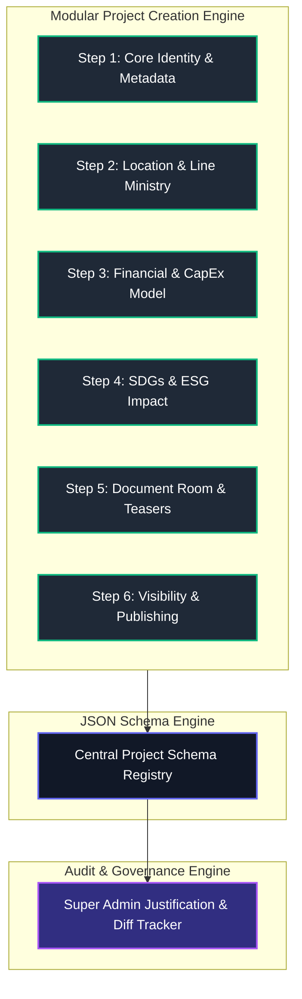

To transform the **Project Creation & Management Module** into a Fortune 100 institutional-grade engine (comparable to Palantir Foundry, IFC/World Bank project portals, and Bloomberg deal terminals), the module must balance **extreme data rigor** with **flawless administrative UX**.

Below is a detailed gap analysis, structural evaluation, and strategic implementation plan based on your platform's requirements.

---

## 1. Fortune 100 Gap Analysis: Existing vs. Institutional Grade

| Module Dimension | Current Baseline | Fortune 100 Institutional Grade | Operational Risk / Gap |
| --- | --- | --- | --- |
| **UN SDG Selection** | Numbers only (e.g., `[7]`, `[9]`) | Full branded SDG badges with titles, target indicators, and DFI impact scoring (e.g., `[7] SDG 7: Clean Energy (Target 7.2)`). | **High Risk:** Confusion, erroneous tagging, and lost trust from sovereign and ESG institutional investors. |
| **Data Structure & Storage** | Monolithic form state | Schema-driven, JSON-schema backboned modular step engine. | **Scalability Risk:** Adding new required fields breaks existing project records or requires heavy refactoring. |
| **Financial Modeling** | Basic high-level CapEx/OpEx | Multi-currency, debt/equity split, IRR/NPV ranges, and concession/guarantee requirements. | **Investor Barrier:** Institutional investors require standardized DFI financial structures to proceed to NDA. |
| **Super Admin Edit Rights** | Fixed state-machine locks | **Omnipresent Sovereign Override Mode** with mandatory inline change justification and diff logs. | **Governance Bottleneck:** Super admins get locked out from correcting critical errors during deal negotiation. |
| **Navigation & Entry Point** | Nested in Project List | Dedicated `+ New Project` standalone creation workspace + Quick Action trigger in sidebar. | **Efficiency Drag:** Friction in starting high-priority sovereign deal entries. |

---

## 2. Strategic Structural Decisions

### A. Should there be a Dedicated Left-Panel Link for Project Creation?

**Yes, absolutely.** In Fortune 100 platforms, primary creation workflows (e.g., *Create AWS Resource*, *Deploy Palantir Pipeline*, *Issue Sovereign Deal*) are never hidden behind multi-click sub-menus.

* **Primary Navigation (Left Panel):** Add a explicit **`+ Create Project`** button at the top of the sidebar under the organization header.
* **Secondary Navigation (Project Registry):** Retain the `+ New Project` button in the top right of the Project Registry header for context-aware creation.
* **Keyboard Shortcut:** Enable `Cmd + N` / `Ctrl + N` global trigger for Super Admins.

---

### B. UN SDG Alignment Module Fix

To eliminate confusion, the SDG selector must transition from raw numbers to a rich, interactive selector card matrix:

```
+---------------------------------------------------------------------------------------------------------+
| UN SUSTAINABLE DEVELOPMENT GOALS (SDGs) & ESG ALIGNMENT                                                 |
| Select up to 4 primary SDG targets to calculate DFI/ESG investor matching algorithms.                   |
+---------------------------------------------------------------------------------------------------------+
| [✓] [🟡 7] SDG 7: Affordable & Clean Energy                                                             |
|     Target 7.2: Increase substantially the share of renewable energy in the global energy mix.          |
|                                                                                                         |
| [ ] [🟠 9] SDG 9: Industry, Innovation & Infrastructure                                                 |
|     Target 9.1: Develop quality, reliable, sustainable and resilient infrastructure.                    |
|                                                                                                         |
| [✓] [🟢 13] SDG 13: Climate Action                                                                      |
|     Target 13.2: Integrate climate change measures into national policies and planning.                 |
+---------------------------------------------------------------------------------------------------------+

```

---

## 3. Super Admin Omnipresent Edit & Audit Mode

Super Admins must have the power to modify any section of a project at any lifecycle stage (`Draft`, `In Review`, `Published`, `Archived`) without breaking state machines.

### Administrative Override Protocol:

1. **Toggle "Super Admin Edit Mode" (`Shift + E`):** Unlocks all form fields across all sections regardless of current status.
2. **Inline Change Tracking:** Modified fields are highlighted with a visual border (e.g., amber halo).
3. **Mandatory Save Justification Drawer:** Clicking `Save Overrides` opens a required audit modal:
* **Reason Code:** (`Document Correction`, `Ministerial Directive`, `Financial Term Adjustment`, `Legal Clearance`).
* **Directive / Reference #:** Optional ticket ID.
* **Justification Note:** Explicit explanation.


4. **Immutable Audit Diff:** The system logs exact `before` and `after` field payloads tied to the Super Admin's ID and IP address.

---

## 4. Implementation Plan: Scalable & Modular Architecture

To ensure the project creation module can scale effortlessly as new requirements are introduced over time, structure the implementation into a **Schema-Driven Modular Form Pipeline**.



---

## 5. Production-Ready React / Tailwind Component Blueprint

Here is the elevated, modular **Project Creation Wizard** incorporating rich SDG selection cards, step navigation, and Super Admin audit override controls.

```tsx
import React, { useState } from 'react';
import { 
  FolderPlusIcon, 
  GlobeAmericasIcon, 
  BanknotesIcon, 
  BuildingLibraryIcon, 
  ShieldCheckIcon,
  CheckCircleIcon,
  ExclamationTriangleIcon,
  ArrowRightIcon,
  ArrowLeftIcon,
  LockClosedIcon
} from '@heroicons/react/24/outline';

interface SDGOption {
  id: number;
  code: string;
  title: string;
  targetDescription: string;
  color: string;
}

const unSdgs: SDGOption[] = [
  { id: 1, code: 'SDG-01', title: 'No Poverty', targetDescription: 'End poverty in all its forms everywhere.', color: 'bg-red-600' },
  { id: 2, code: 'SDG-02', title: 'Zero Hunger', targetDescription: 'End hunger, achieve food security and improved nutrition.', color: 'bg-amber-500' },
  { id: 7, code: 'SDG-07', title: 'Affordable & Clean Energy', targetDescription: 'Increase substantially the share of renewable energy in national grid.', color: 'bg-yellow-500' },
  { id: 8, code: 'SDG-08', title: 'Decent Work & Economic Growth', targetDescription: 'Promote sustained, inclusive economic growth and employment.', color: 'bg-red-800' },
  { id: 9, code: 'SDG-09', title: 'Industry, Innovation & Infrastructure', targetDescription: 'Build resilient infrastructure and foster sustainable industrialization.', color: 'bg-orange-500' },
  { id: 13, code: 'SDG-13', title: 'Climate Action', targetDescription: 'Take urgent action to combat climate change and its impacts.', color: 'bg-emerald-700' },
];

export const InstitutionalProjectCreationWizard: React.FC<{ isSuperAdmin?: boolean }> = ({ 
  isSuperAdmin = true 
}) => {
  const [currentStep, setCurrentStep] = useState<number>(1);
  const [selectedSdgs, setSelectedSdgs] = useState<number[]>([7, 9]);
  
  // Super Admin Override Mode State
  const [adminOverrideActive, setAdminOverrideActive] = useState<boolean>(false);
  const [showJustificationModal, setShowJustificationModal] = useState<boolean>(false);
  const [overrideReason, setOverrideReason] = useState<string>('');

  const toggleSdg = (id: number) => {
    if (selectedSdgs.includes(id)) {
      setSelectedSdgs(selectedSdgs.filter(item => item !== id));
    } else {
      if (selectedSdgs.length < 4) {
        setSelectedSdgs([...selectedSdgs, id]);
      }
    }
  };

  return (
    <div className="w-full space-y-6 bg-zinc-950 p-6 text-zinc-100 rounded-xl border border-zinc-800 font-sans">
      
      {/* Top Creation Header */}
      <div className="flex flex-col sm:flex-row sm:items-center justify-between gap-4 pb-4 border-b border-zinc-800">
        <div>
          <div className="flex items-center space-x-2">
            <span className="px-2 py-0.5 text-[10px] font-mono font-bold uppercase tracking-widest text-emerald-400 bg-emerald-500/10 border border-emerald-500/20 rounded">
              Institutional Deal Studio
            </span>
            {isSuperAdmin && (
              <button 
                onClick={() => setAdminOverrideActive(!adminOverrideActive)}
                className={`px-2 py-0.5 text-[10px] font-mono font-bold uppercase tracking-widest rounded border transition ${
                  adminOverrideActive 
                    ? 'bg-amber-500/20 border-amber-500/40 text-amber-300' 
                    : 'bg-zinc-800 border-zinc-700 text-zinc-400 hover:text-white'
                }`}
              >
                {adminOverrideActive ? '⚡ Super Admin Override Active' : 'Enable Admin Override'}
              </button>
            )}
          </div>
          <h1 className="text-2xl font-bold tracking-tight text-white mt-1">Create Institutional Project Record</h1>
          <p className="text-sm text-zinc-400 mt-1">Configure sovereign deal parameters, CapEx models, and SDG impact metrics.</p>
        </div>

        <div className="text-right font-mono text-xs text-zinc-400">
          Step <span className="text-emerald-400 font-bold">{currentStep}</span> of 5
        </div>
      </div>

      {/* Step Indicator Bar */}
      <div className="grid grid-cols-5 gap-2 text-xs font-semibold">
        {[
          { step: 1, label: 'Identity & Sector' },
          { step: 2, label: 'Financial Model' },
          { step: 3, label: 'SDGs & Impact' },
          { step: 4, label: 'Deal Documents' },
          { step: 5, label: 'Governance' },
        ].map(s => (
          <button
            key={s.step}
            onClick={() => setCurrentStep(s.step)}
            className={`p-2.5 rounded-lg text-left border transition ${
              currentStep === s.step 
                ? 'bg-emerald-500/10 border-emerald-500 text-emerald-400' 
                : currentStep > s.step 
                ? 'bg-zinc-900 border-zinc-800 text-zinc-300' 
                : 'bg-zinc-950 border-zinc-900 text-zinc-600'
            }`}
          >
            <div className="text-[10px] font-mono uppercase">0{s.step}</div>
            <div className="truncate mt-0.5">{s.label}</div>
          </button>
        ))}
      </div>

      {/* Step 3: UN SDGs & Impact Section (Highlighting Gap Fix) */}
      {currentStep === 3 && (
        <div className="space-y-6 animate-in fade-in duration-200">
          <div className="p-4 rounded-xl bg-zinc-900/60 border border-zinc-800">
            <div className="flex items-center justify-between mb-2">
              <h2 className="text-sm font-bold uppercase tracking-wider text-white flex items-center space-x-2">
                <GlobeAmericasIcon className="w-5 h-5 text-emerald-400" />
                <span>UN Sustainable Development Goals (SDGs) Tagging</span>
              </h2>
              <span className="text-xs font-mono text-emerald-400">{selectedSdgs.length} / 4 Selected</span>
            </div>
            <p className="text-xs text-zinc-400 leading-relaxed">
              Select primary SDG alignments. These tags directly drive institutional ESG scoring and international DFI deal room routing.
            </p>
          </div>

          <div className="grid grid-cols-1 md:grid-cols-2 gap-4">
            {unSdgs.map(sdg => {
              const isSelected = selectedSdgs.includes(sdg.id);
              return (
                <div
                  key={sdg.id}
                  onClick={() => toggleSdg(sdg.id)}
                  className={`p-4 rounded-xl border transition-all duration-200 cursor-pointer flex items-start space-x-3.5 relative ${
                    isSelected 
                      ? 'bg-zinc-900 border-emerald-500/80 ring-1 ring-emerald-500/30' 
                      : 'bg-zinc-900/40 border-zinc-800/80 hover:border-zinc-700'
                  }`}
                >
                  <div className={`w-9 h-9 rounded-lg ${sdg.color} text-white font-black text-sm flex items-center justify-center shrink-0 shadow-md`}>
                    {sdg.id}
                  </div>
                  <div className="flex-1 min-w-0">
                    <div className="flex items-center justify-between">
                      <span className="text-xs font-mono text-zinc-400">{sdg.code}</span>
                      {isSelected && <CheckCircleIcon className="w-4 h-4 text-emerald-400 shrink-0" />}
                    </div>
                    <h3 className="text-sm font-bold text-white mt-0.5 truncate">{sdg.title}</h3>
                    <p className="text-xs text-zinc-400 mt-1 line-clamp-2 leading-relaxed">{sdg.targetDescription}</p>
                  </div>
                </div>
              );
            })}
          </div>
        </div>
      )}

      {/* Navigation Footer */}
      <div className="pt-4 border-t border-zinc-800 flex items-center justify-between">
        <button
          disabled={currentStep === 1}
          onClick={() => setCurrentStep(prev => Math.max(1, prev - 1))}
          className="px-4 py-2 text-xs font-semibold rounded-lg border border-zinc-800 bg-zinc-900 hover:bg-zinc-800 text-zinc-300 disabled:opacity-40 disabled:cursor-not-allowed flex items-center space-x-2"
        >
          <ArrowLeftIcon className="w-4 h-4" />
          <span>Previous Step</span>
        </button>

        <div className="flex items-center space-x-3">
          {adminOverrideActive && (
            <button
              onClick={() => setShowJustificationModal(true)}
              className="px-4 py-2 text-xs font-bold rounded-lg bg-amber-600/20 text-amber-300 border border-amber-500/30 hover:bg-amber-600/30 transition flex items-center space-x-1.5"
            >
              <ShieldCheckIcon className="w-4 h-4" />
              <span>Force Save Record</span>
            </button>
          )}

          <button
            onClick={() => setCurrentStep(prev => Math.min(5, prev + 1))}
            className="px-5 py-2 text-xs font-bold uppercase tracking-wider rounded-lg bg-emerald-600 hover:bg-emerald-500 text-white transition flex items-center space-x-2 shadow-lg"
          >
            <span>{currentStep === 5 ? 'Publish Deal' : 'Save & Continue'}</span>
            <ArrowRightIcon className="w-4 h-4" />
          </button>
        </div>
      </div>

      {/* Super Admin Audit Justification Modal */}
      {showJustificationModal && (
        <div className="fixed inset-0 bg-black/80 backdrop-blur-sm flex items-center justify-center p-4 z-50">
          <div className="bg-zinc-900 border border-zinc-800 rounded-xl p-6 max-w-md w-full shadow-2xl space-y-4">
            <div className="flex items-center space-x-2 text-amber-400">
              <ExclamationTriangleIcon className="w-6 h-6" />
              <h3 className="text-lg font-bold text-white">Super Admin Override Justification</h3>
            </div>
            <p className="text-xs text-zinc-400 leading-relaxed">
              Modifying an active or published project record bypasses standard workflow queues. You must log a justification for the sovereign audit trail.
            </p>
            <textarea
              rows={3}
              placeholder="e.g. Corrected CapEx schedule per Ministerial Clearance #DIR-2026-90..."
              value={overrideReason}
              onChange={(e) => setOverrideReason(e.target.value)}
              className="w-full bg-zinc-950 border border-zinc-800 rounded-lg p-2.5 text-xs text-white focus:outline-none focus:border-emerald-500"
            />
            <div className="flex justify-end space-x-3 pt-2">
              <button
                onClick={() => setShowJustificationModal(false)}
                className="px-4 py-2 text-xs text-zinc-400 hover:text-white transition"
              >
                Cancel
              </button>
              <button
                disabled={!overrideReason}
                onClick={() => {
                  setShowJustificationModal(false);
                  alert('Override saved and logged to Audit Trail.');
                }}
                className={`px-4 py-2 text-xs font-semibold rounded-lg transition ${
                  overrideReason ? 'bg-amber-600 hover:bg-amber-500 text-white' : 'bg-zinc-800 text-zinc-600 cursor-not-allowed'
                }`}
              >
                Commit & Write Audit
              </button>
            </div>
          </div>
        </div>
      )}

    </div>
  );
};

```