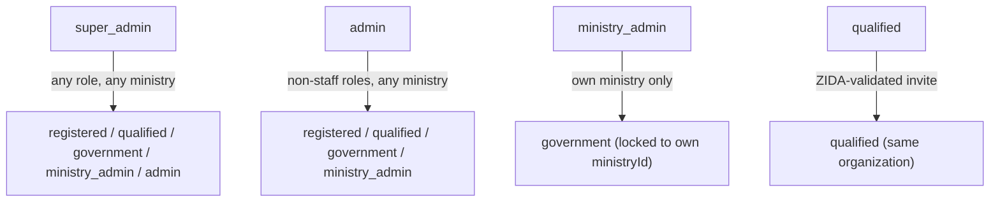

# Role & Entitlement Model

Platform Feedback Batch v3, Phase 1. The reference doc for "who can create whom, and what do they
inherit?" — written because the platform has six `AccountRole` values (`lib/auth/types.ts`) but three
*disconnected* user-creation surfaces that had each grown their own ad-hoc rules. This doc is the
single source of truth; the code cited below is what actually enforces it (never trust a UI to be the
real ceiling — every route re-checks server-side).

## The six roles

| Role | What they are | Scoped to |
|---|---|---|
| `registered` | Any signed-up visitor, no vetting yet | Nothing — browse-only tier |
| `qualified` | A vetted investor organization | Their own organization |
| `government` | ZIDA-vetted government/ministry staff, reviewer-only authority | Their own `ministryId` (if set) |
| `ministry_admin` | A ministry's own console-admin-equivalent — full create/edit/approve rights on their ministry's own projects; Publish is ZIDA-only | Their own `ministryId` |
| `admin` | ZIDA console staff | Platform-wide, below `super_admin` |
| `super_admin` | Afronovation (platform owner) | Platform-wide, no ceiling |

`ministry_admin` is one generic role, not "primary" and "backup" role keys — the seed simply
provisions two accounts at that one role per ministry (see `.env.local`, `lib/db/seed/accounts.ts`).

## Who can create whom, and what a new user inherits

| Creator | Surface | Who they can create | What the new account inherits |
|---|---|---|---|
| `super_admin` | `POST /api/users/create` (`CreateUserModal`) | Any role, any ministry | Whatever the operator types in — no inheritance, since super_admin has no ceiling |
| `admin` | `POST /api/users/create` (`CreateUserModal`) | `registered`, `qualified`, `government`, `ministry_admin` — never `admin`/`super_admin` | Same as above |
| `ministry_admin` | `POST /api/users/create` (own `/ministry/users` page, new in this batch) | **Only** `government`, force-locked to their own `ministryId` | Role and ministry are forced server-side regardless of what the client sends — a ministry_admin can never mint a `government` staffer outside their own ministry via this route |
| `qualified` | `POST /api/org-team/invites` (`/deal-room/teams`, ZIDA Four-Eyes validated) | Teammates for their own org | **Same role and organization as the inviting qualified investor** (unchanged, already correct before this batch) |
| `ministry_admin` | `POST /api/org-team/invites` (`/ministry/teams`, ZIDA Four-Eyes validated) | A peer for their own ministry desk | **Same role (`ministry_admin`) and `ministryId` as the inviting owner** — deliberately kept as-is (see below); this is the "request a backup Ministry Admin" path, not a way to create ordinary staff |

### The one exception rule

`admin`/`super_admin` may grant **any** entitlement on a case-by-case basis, outside of the rules
above — e.g. hand-crafting a `government` account with a specific `ministryId` and no team-invite
involvement at all ("ZIDA Coordinator" template), or promoting/demoting any non-staff role via
`PATCH /api/users/[id]`. This is intentional: the tables above describe the *self-service* ceilings
each role has for creating others, not a hard platform-wide limit on what ZIDA staff can configure by
hand. There is no separate `AccountRole` enum value for "ZIDA Coordinator" — `government` +
`ministryId` (+ optional per-project `assignedStaffUserId`) already models it.

### Two different ministry-desk creation paths, on purpose

Before this batch, `/ministry/teams`'s org-invite pipeline was the *only* way a `ministry_admin`
could add anyone — and it always minted another `ministry_admin` peer (`approveOrgInvite` mirrors the
inviting owner's own role, same as it does for `qualified` invitees). That's fine for its actual use
case (a rare, ZIDA-validated "backup admin" request for the ministry desk) but left no path at all
for the *common* case: adding ordinary ministry staff who should review/administer projects but never
hold console-admin-equivalent authority themselves. This batch adds that second path without
touching the first:

- **`/ministry/teams`** (org-invite, ZIDA Four-Eyes validated) → still mints a `ministry_admin` peer.
  Keep using this only for the genuine "we need a backup admin" case.
- **`/ministry/users`** (new, direct create, instant) → mints ordinary `government`-role staff,
  force-locked to the creator's own `ministryId`. This is the one to use for everyday staff
  provisioning — no ZIDA validation round-trip needed, since the ceiling (`government`, own ministry
  only) is narrow enough to be safe as instant self-service.

## Enforcement — where this is actually implemented

- `lib/auth/user-governance.ts` — `assignableRoles(actorRole)` is the authoritative ceiling table for
  direct creation (`POST /api/users/create`) and role changes (`PATCH /api/users/[id]`).
- `app/api/users/create/route.ts` — forces `role = "government"` and `ministryId = actor.ministryId`
  whenever the actor is a `ministry_admin`, regardless of what the request body contains.
- `lib/db/queries/org-team.ts` (`approveOrgInvite`) — the org-invite approval path that mints
  `qualified`-org and `ministry_admin`-ministry teammates; see `docs/Team Member Lifecycle.md` for the
  full invite → validate → assign flow.
- `lib/auth/project-workflow-role.ts` (`resolveProjectWorkflowRole`) — the *project-level* analogue:
  `ministry_admin` is "reviewer" only for their own ministry's projects, never another ministry's —
  full stewardship through Approved, but Publish is admin/super_admin-only (Platform Feedback Batch
  v4, Phase 7 — ZIDA is the final validation gate, by design).
- `POST /api/projects/[id]/amendment-request` + `POST /api/messages/[id]/action` — a `government`
  reviewer's change request on their own ministry's approved/published project is two-stage
  (Platform Feedback Batch v4, Phase 8): their own `ministry_admin` approves or declines first;
  approval escalates to `admin`/`super_admin` for the final apply. `ministry_admin` keeps
  direct-edit-with-reason authority on their own ministry's projects — this path is only for
  `government`. Falls back to filing straight to ZIDA if the ministry has no active
  `ministry_admin`. Super Admin may override an `"open"` card directly.

## Routing

`ministry_admin` lands on `/ministry` after sign-in (`lib/auth/post-login-destination.ts`), never
`/deal-room` — previously a latent bug sent every non-admin role there regardless of console
entitlement (`consolesForRole()` in `components/dashboard/dashboard-nav-config.ts` already said
`ministry_admin` only belongs on `/ministry`; the login redirect just never matched it).

## Console parity

`ministry_admin` has a small, deliberately scoped console (`MINISTRY_NAV`) mirroring `admin`'s shape
one level down:

| `/admin` (ZIDA staff) | `/ministry` (ministry_admin) | Scope difference |
|---|---|---|
| Projects | Ministry Pipeline | Own ministry's projects only |
| Review Queue | Review Queue (`/ministry/review`) | Own ministry's submissions + government-filed amendment requests awaiting stage-1 decision |
| Users & Roles | Users | Create/view `government` staff for own ministry only — no role changes, no suspend/reactivate |
| — | Team | Org-invite pipeline (rare "request a backup admin" case) |
| Reports | Reports | "My Activity Summary" scoped to own ministry's engagements (reuses `PersonalActivityReport`) |

`/deal-room/teams`'s page gate was also tightened to drop `government` — they have no org-invite
rights server-side today (the pipeline is owner-scoped to `qualified`/`ministry_admin` only), so
showing them the page was a latent nav-gate bug, not an intended entitlement.
