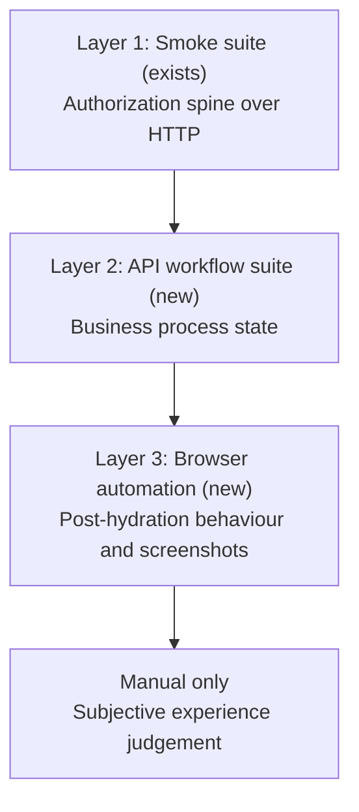

# Pilot Verification and Stakeholder Walkthrough Plan

*Afronovation | Zimbabwe Digital Investment & Economic Intelligence Platform | Walkthrough Guide v1.0*
*Prepared for pilot review | September 2026*

## Executive Snapshot

| Question | Answer |
| --- | --- |
| What is proposed? | A two-layer automated verification suite that replaces the manual six-role walkthrough, and a set of seven persona walkthrough documents that let ZIDA and Government of Zimbabwe stakeholders exercise the platform themselves. |
| Why automate the walkthrough? | The manual walkthrough is slow, non-repeatable, and produces no artifact. Automation runs in minutes, proves the same assertions every time, and generates the screenshots the stakeholder documents require. |
| What cannot be automated? | Subjective user-experience judgement. Everything else — authorization, business workflow state, post-hydration redirect behaviour, and loading transitions — is covered by one of the three layers. |
| What do stakeholders receive? | One document per persona explaining who that persona is, what they can and cannot do, a tour of their dashboard, and every process they can perform as numbered steps with screenshots and a structured place to record enhancement requests. |
| What is the canonical environment? | `https://zidaproject.com`. Every URL in every document derives from it. |
| What is the governing risk? | Production and local development share one database with no staging branch, so any test that writes data must use disposable accounts rather than the pilot accounts the demo depends on. |
| What is the requested next step? | Execute the delivery sequence in section 11, beginning with browser automation so that screenshot capture and document authoring can start early. |

## Contents

1. Executive Summary
2. Purpose and Scope
3. Current Platform State
4. Verification Architecture
5. Canonical URL and Environment
6. Persona Model and Concept Note Alignment
7. Automated Verification Layers
8. Test Data Isolation Model
9. Stakeholder Walkthrough Documentation
10. Document Production Toolchain
11. Delivery Sequence
12. Success Measures
13. Known Limitations and Deferred Items
14. Source Notes

---

## 1. Executive Summary

The pilot platform is deployed and functional. What it lacks is a repeatable way to prove that it works and an accessible way for stakeholders to evaluate it. This plan addresses both with a single body of work, because the same browser automation that verifies behaviour also produces the screenshots the stakeholder documents need.

Verification is organised in three layers. The existing six-role smoke suite already proves the authorization spine over HTTP. A new API workflow suite covers business processes — applications, approvals, role changes, ministry scoping — that the smoke suite cannot reach. Browser automation covers what neither can see: behaviour that only exists after the page hydrates.

The stakeholder deliverable is seven documents, one per persona. Each explains who the persona is, presents their dashboard, enumerates capabilities and limitations, and walks through every process available to them with a screenshot at each step. Each document carries a structured feedback section so that gaps become recorded enhancement requests rather than scattered correspondence.

**Core message**

*The platform is built. This plan makes its behaviour provable and its capabilities legible to the institutions that will decide whether to adopt it.*

## 2. Purpose and Scope

The purpose is to close the pilot with evidence rather than assertion, and to hand ZIDA and the Government of Zimbabwe a means of evaluating the platform without technical mediation.

In scope:

- Automated verification of authorization, business workflow, and client-side behaviour against production
- A defect log capturing everything the automation finds, with remediation
- Seven persona walkthrough documents in the format established by the Concept Note v0.3
- A document production toolchain that emits both Markdown and Word output from one source

Out of scope for this phase: performance and load testing, penetration testing, accessibility audit, and the deferred personas identified in section 6.

## 3. Current Platform State

| Dimension | State |
| --- | --- |
| Deployment | Live at the canonical URL, commit `eabc048` |
| Consoles | Four — Investor Dashboard, Ministry Desk, ZIDA Admin, Platform Admin |
| Dashboard pages | Approximately 56 across the four consoles |
| Account roles | Six — registered, qualified, government, ministry_admin, admin, super_admin |
| Governed workflows | Six — project lifecycle, engagements, MOU, NDA gate, qualified-investor application, ministry association requests |
| Transactional email | Live; `zidaproject.com` verified with Resend, all four inquiry-lifecycle templates delivering |
| Entitlements | Re-audited September 2026 after the authentication refactor; two write-side gaps found and closed |
| Existing automation | Six-role smoke suite covering the authorization spine |

## 4. Verification Architecture

Each layer proves something the layer above it cannot reach.

The boundary between layers two and three is not a matter of convenience. Two consoles, the Investor Dashboard and the Ministry Desk, wrap their content in a gate that renders a placeholder while the session loads. Neither the console nor the access-denied notice appears in the server response, so an HTTP-level check can only prove that no console content was served — never that the user was redirected somewhere correct. That assertion requires a real browser.

**Verification logic**

*The smoke suite proves who may enter. The workflow suite proves what happens once inside. Browser automation proves what the user actually sees.*

## 5. Canonical URL and Environment

The platform previously answered on both the apex domain and the `www` subdomain, each returning a successful response independently. Two canonical URLs is a defect in its own right, and it would have produced inconsistent links across the stakeholder documents.

The apex is now canonical. `www` issues a permanent redirect to it, configured in `next.config.ts`. This matches `NEXT_PUBLIC_SITE_URL` and the call-to-action links in every transactional email.

| Purpose | URL |
| --- | --- |
| Platform root | `https://zidaproject.com` |
| Sign in | `https://zidaproject.com/auth/sign-in` |
| Investor Dashboard | `https://zidaproject.com/deal-room` |
| Ministry Desk | `https://zidaproject.com/ministry` |
| ZIDA Admin | `https://zidaproject.com/admin` |
| Platform Admin | `https://zidaproject.com/super-admin` |

Every URL in every stakeholder document derives from the apex. Should the domain change, the documents describe processes and paths that remain valid under the new host.

## 6. Persona Model and Concept Note Alignment

Concept Note v0.3 section 10 defines ten personas. The platform implements six account roles. The two do not correspond one-to-one, and each stakeholder document opens by stating the relationship explicitly.

| Concept note persona | Implemented as | Status |
| --- | --- | --- |
| Public Visitor | Unauthenticated access | Live |
| Registered Investor | `registered` | Live |
| Qualified Investor / Strategic Partner | `qualified` | Live |
| ZIDA / Investment Authority Admin | `admin` | Live |
| Beneficiary Ministry User | `ministry_admin` | Live |
| Afronovation Super Admin | `super_admin` | Live |
| Afronovation Platform Manager | Folded into `super_admin` | Partial |
| Diaspora Investor | Not implemented as a distinct role | Deferred |
| Project Owner | Not implemented as a distinct role | Deferred |
| Embassy Investment Desk User | Not implemented as a distinct role | Deferred |
| *(no concept note equivalent)* | `government` — reviewer role | Live, undocumented in the concept note |

Two observations follow. The `government` reviewer role exists in the platform but was never described to stakeholders, so its documentation is new information. And three promised personas remain deferred, which the concept note anticipated when it noted that the MVP should demonstrate the entitlement structure even if the full model arrives in a later phase.

**Governance note**

*Presenting this mapping openly is the point. Stakeholders arrive holding the concept note; the table tells them which promised persona they are testing, which are deferred, and where the platform went beyond the note.*

## 7. Automated Verification Layers

### 7.1 Layer one — smoke suite

Already implemented. For each of the six roles it asserts sign-in, the role reported by the session endpoint, financial-field gating between registered and qualified tiers, the correct landing route, refusal of every forbidden console, and the cache directive that prevents a shared cache serving one user's console to another. It reports the deployed commit first, so a stale deployment invalidates the run visibly rather than silently.

### 7.2 Layer two — API workflow suite

New. Covers the business processes the smoke suite does not touch.

| Workflow | Assertions |
| --- | --- |
| Qualified investor application | Submission succeeds; an incomplete payload is rejected; a second submission while one is pending is refused; approval upgrades the account to qualified; the role-change and submission audit records are written |
| Manual role promotion | Promotion to qualified is refused when the applicant's verification information is incomplete, and succeeds once complete |
| Ministry scoping | A ministry official cannot reassign a project to another ministry, cannot modify another ministry's project, and cannot upload attachments to one |
| Tier gating | A registered investor is refused on engagement, message, MOU, and deal-team endpoints |

The ministry scoping assertions carry particular weight. Both were closed only recently and neither has any regression coverage. One of the two fixes strips the offending field silently and still returns success, so the test must re-read the record and compare values — asserting the response status alone would pass against the vulnerable code.

### 7.3 Layer three — browser automation

New. Covers behaviour that exists only after hydration, and produces the screenshot corpus for the stakeholder documents.

| Check | What it proves |
| --- | --- |
| Console redirects | A wrong-role user navigating directly to a forbidden console comes to rest on their own console, not merely that no content was served |
| Landing destination | Each role arrives at the correct console after sign-in |
| No authentication flash | Restricted financial data is never briefly visible during hydration |
| Placeholder resolution | Every console reaches a loaded state rather than resting on a skeleton, the documented symptom of a stale deployment |
| Interaction states | Submission controls disable while in flight; failures surface a visible error |

## 8. Test Data Isolation Model

Production and local development address the same database, and no separate branch exists. Running the suite locally therefore provides no isolation whatsoever, and any test that writes data writes to the environment stakeholders will be shown.

The consequence is specific rather than theoretical. Exercising the approval workflow means promoting an account to qualified. Performed against a pilot account, it would consume the very fixture the demonstration depends on, because that account's value lies in being in a pre-approval state.

Isolation therefore comes from account scope rather than environment. Every write-path test provisions its own accounts under a naming convention the cleanup tooling already recognises, and removes them afterwards. The seven pilot accounts are protected by an explicit allowlist and are never written to.

Two defects in the existing cleanup tooling must be closed first. It removes the authentication record but not the associated profile, and because the two are linked by convention rather than by a database constraint, every removed account leaves a permanent orphaned profile visible in the administrative user directory. Separately, one seeded pilot account is missing from the protective allowlist.

## 9. Stakeholder Walkthrough Documentation

Seven documents, one per persona, each self-contained so that a participant receives only the document for the role they are testing.

| Document | Persona | Distribution |
| --- | --- | --- |
| 1 | Public Visitor | Open |
| 2 | Registered Investor | UAT participants |
| 3 | Qualified Investor | UAT participants |
| 4 | Government Reviewer | Government stakeholders |
| 5 | Ministry Official | Ministry stakeholders |
| 6 | ZIDA Admin | ZIDA console operators |
| 7 | Platform Admin | Afronovation internal — not distributed |

The seventh is separated on organisational grounds rather than by privilege level. The ZIDA Admin console belongs to the Government of Zimbabwe's investment authority; the Platform Admin console belongs to Afronovation as platform owner and covers taxonomy management, entitlement configuration, publishing override, and the audit trail. Documenting both in one place would place platform-operator capability into a document held by the client.

Each document follows a fixed structure:

| Section | Content |
| --- | --- |
| Executive Snapshot | What this document is, who it is for, the environment, credentials, what to do with findings |
| Persona definition | Who this persona is and their concept note lineage |
| Access | The sign-in URL, what appears on arrival, and why |
| Dashboard presentation | Each navigation item, what it shows, with a screenshot |
| Capabilities | What this persona can do, as a table |
| Limitations | What this persona cannot do, and which role holds that authority instead |
| Processes | Each capability as numbered steps with a screenshot per step |
| Feedback | A structured table for observations and enhancement requests |
| Validation note | Seeded records are illustrative and pending official validation |

The limitations section is not filler. It is where entitlement boundaries become visible, and it is the section most likely to generate the enhancement requests the exercise exists to collect.

## 10. Document Production Toolchain

Markdown is the source of truth: version-controlled, diffable, reviewable. A generator emits Word output using the document library already present in the codebase for memorandum export, extended with image embedding for the captured screenshots.

This matters because screenshots would otherwise be the maintenance burden that stops the documents from staying current. When the interface changes, the capture pass re-runs and every image in every document updates from one command, rather than someone reopening seven Word files and re-pasting images by hand.

Generated Word files are build artifacts and are not committed.

## 11. Delivery Sequence

| Stage | Work | Rationale |
| --- | --- | --- |
| 1 | Canonical URL redirect | Every documented link depends on it |
| 2 | This plan document | Establishes the shared format |
| 3 | Browser automation and screenshot capture | Earliest possible start on documents; verifies navigation before it is described |
| 4 | Document toolchain | Shared formatting for all subsequent output |
| 5 | Seven persona documents | The stakeholder deliverable |
| 6 | Cleanup tooling repair and test fixtures | Prerequisite for write-path testing |
| 7 | API workflow suite | Business process regression coverage |
| 8 | Full run and defect log | Consolidated evidence, remediation, clean re-run |

Browser automation precedes the workflow suite deliberately. It unblocks the stakeholder documents, which are the awaited deliverable, and it confirms navigation before any document describes it.

## 12. Success Measures

- Every one of the six roles is verified end to end without manual intervention
- Both recently closed ministry scoping fixes carry regression coverage
- No stakeholder document describes a path that automation has not exercised
- A stakeholder can complete their persona walkthrough without technical assistance
- Enhancement requests arrive in a structured, attributable form
- The full suite runs against production in under fifteen minutes
- Screenshots regenerate from a single command

## 13. Known Limitations and Deferred Items

| Item | Status |
| --- | --- |
| Diaspora Investor, Project Owner, Embassy Investment Desk personas | Deferred beyond pilot |
| Dedicated access-requests console | Recorded in the backlog with the revocation gap noted |
| Performance, load, and penetration testing | Out of scope for this phase |
| Accessibility audit | Out of scope for this phase |
| Subjective experience assessment | Remains a human judgement |
| Separate staging database branch | Not provisioned; mitigated by the account isolation model in section 8 |

## 14. Source Notes

| Source | Use |
| --- | --- |
| Concept Note v0.3 | Document format, persona model, governance vocabulary, workflow state definitions |
| Existing UAT Test Guide | Inventory of surfaces and roles; superseded for stakeholder-facing purposes |
| Production Migration Plan | Environment configuration, canonical URL, transactional email status |
| Platform codebase | Authoritative source for roles, transitions, entitlements, and routes |

**Important validation note**

*Seeded demonstration records are illustrative and marked pending official validation. Financial indicators, project readiness claims, ministry mappings, and supporting documents should be validated by ZIDA and the relevant authorities before production publication. The platform treats imported records as draft or pending validation until approved through the governance workflow.*
